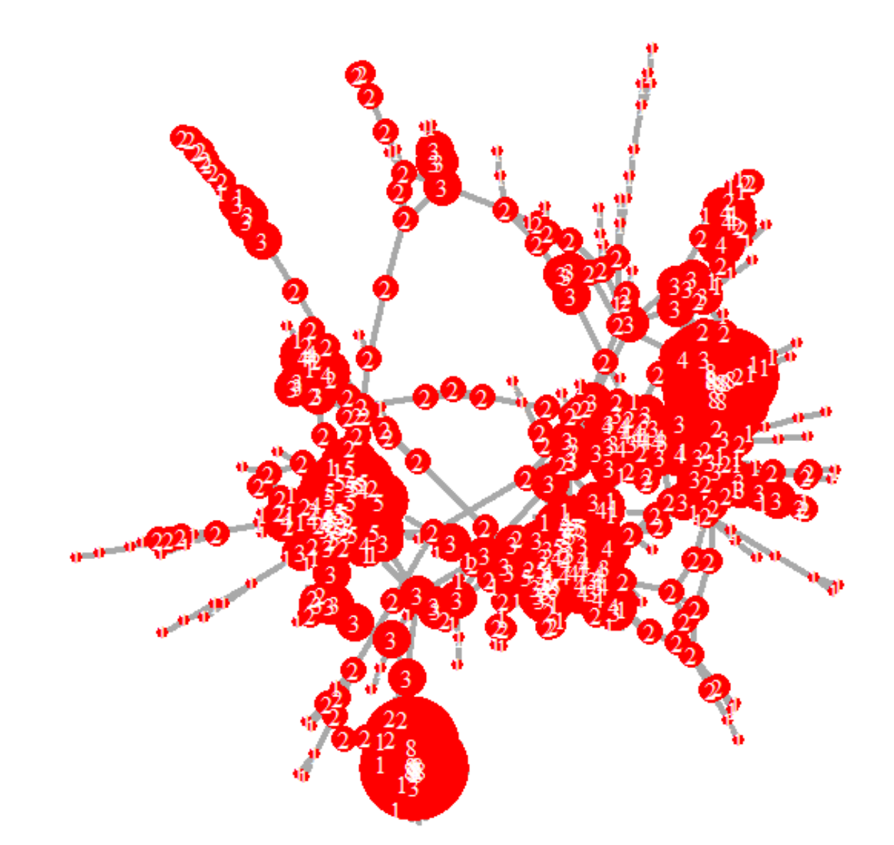
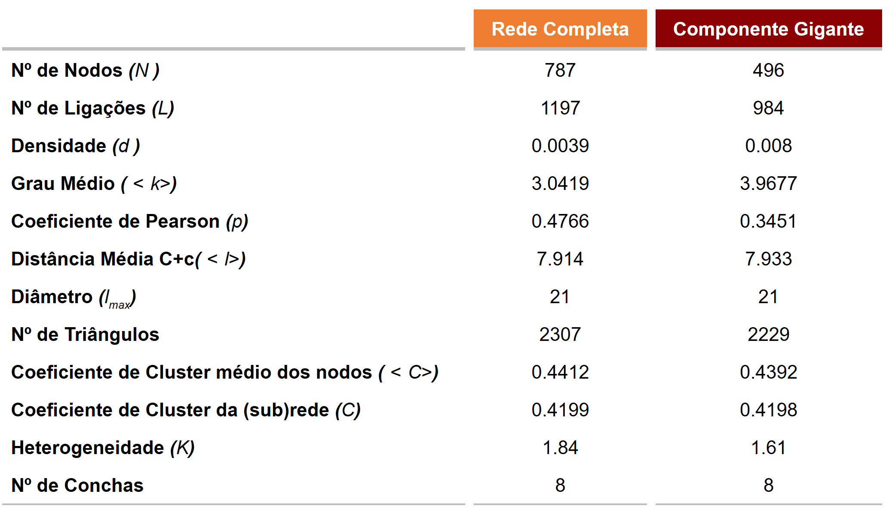
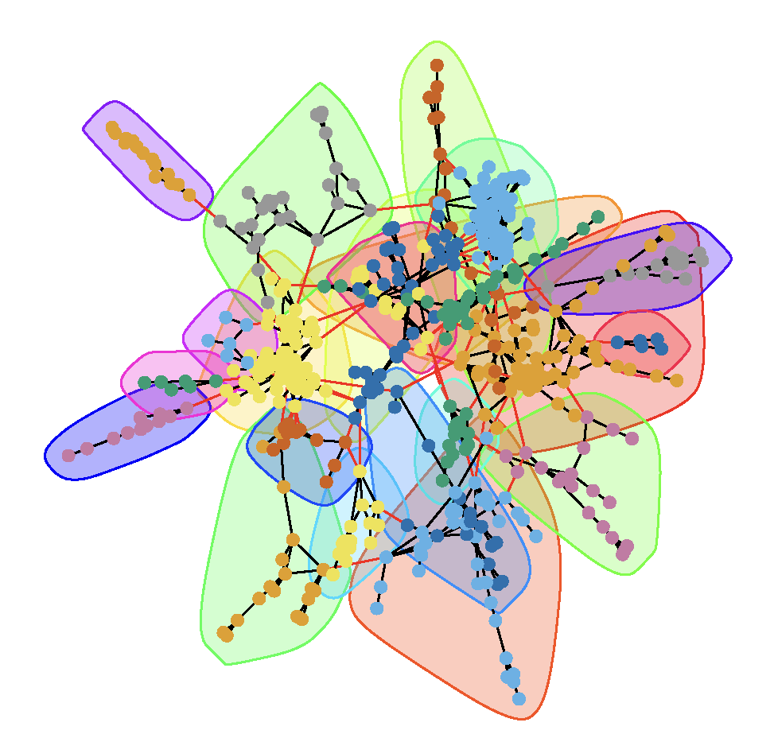
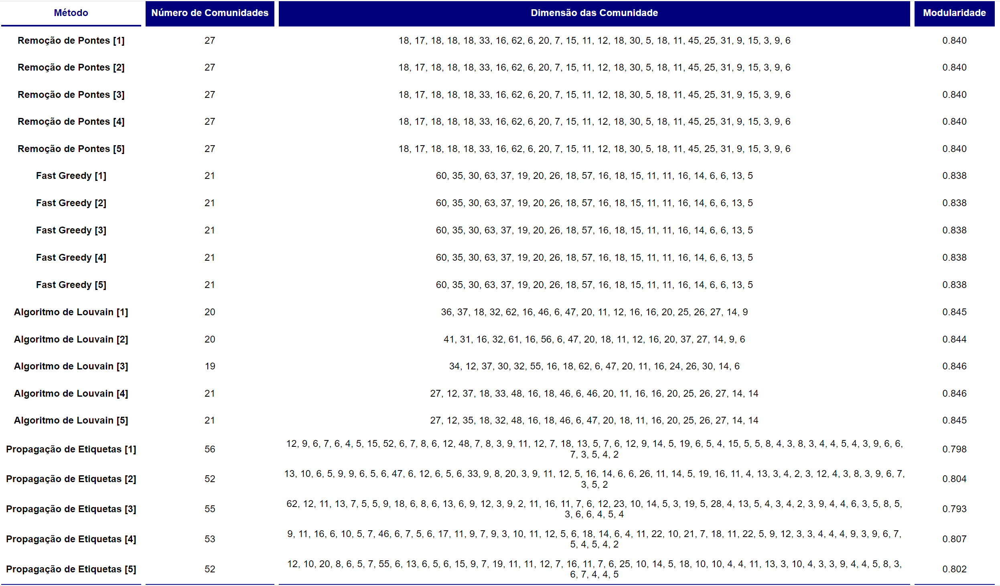

# 🌐 Network Analysis in R: From Social Graphs to Community Detection 🕸️

<p align="center">
  
</p>

<p align="center">
    <!-- Project Links -->
    <a href="https://github.com/Silvestre17/NetworkAnalysis_Projects"></a>
</p>

## 📝 Description

This repository contains a collection of projects developed for the **Network Analysis** course, focusing on the study of complex networks using the **R programming language** and the `igraph` package. The projects cover the fundamental analysis of a static social network and extend to the generation and community detection in random networks.

## ✨ Objective

The core objective of these projects is to apply graph theory concepts to understand and interpret network structures. This includes:
*   Calculating and interpreting key network metrics to describe a graph's topology.
*   Analyzing the structure of the network's **giant component**.
*   Implementing the **Random Walk Model** to generate and compare synthetic networks.
*   Applying and evaluating various **community detection algorithms** to identify subgroups within a network.

## 🎓 Project Context

This work was completed for the **Análise de Redes** (*Network Analysis*) course as part of the 3rd year of the **[Licenciatura em Ciência de Dados](https://www.iscte-iul.pt/degree/code/0322/bachelor-degree-in-data-science)** (*Bachelor Degree in Data Science*) at **ISCTE-IUL**, during the 2023/2024 academic year (1st semester).

## 🛠️ Technologies & Key Libraries

All analysis and visualizations were conducted in the **R** ecosystem, with a heavy reliance on the `igraph` package for network manipulation and analysis.

<p align="center">
    <a href="https://www.r-project.org/">
        
    </a>
    <a href="https://www.rstudio.com/">
        
    </a>
    <a href="https://igraph.org/r/">
        
    </a>
    <a href="https://www.tidyverse.org/">
        
    </a>
    <a href="https://davidgohel.github.io/flextable/">
        
    </a>
</p>

---

## 📚 Project Breakdown

This repository is organized into two main projects.

### 1️⃣ [Project 1: Social Contact Network Analysis](./NetworkAnalysis_Project1/)

This project involved a deep analysis of a static, undirected network representing direct social contacts between inhabitants of a residential area. The goal was to characterize the network's structure and properties.

#### Key Metrics & Concepts Analyzed:
*   **Basic Properties:** Calculated the network's **dimension** (787 nodes, 1197 edges) and **density** (0.0038), confirming it as a sparse network.
*   **Degree Analysis:** Analyzed the **degree distribution**, finding an average degree of ~3.04 and identifying a heterogeneous network structure.
*   **Connectivity:** Determined the network was not connected and was composed of **104 components**, identifying and isolating the **Giant Component** (496 nodes) for further study.
*   **Structural Metrics:**
    *   **Degree Assortativity:** Calculated Pearson's correlation coefficient for degrees of connected nodes to measure if high-degree nodes tend to connect to other high-degree nodes.
    *   **Path Lengths & Diameter:** Computed the average path length (~7.9) and the network diameter (21).
    *   **Triadic Closure:** Calculated the number of triangles and the **clustering coefficient** to measure the network's tendency to form tightly-knit groups.
    *   **k-Core Decomposition:** Decomposed the network into shells to identify the most central and dense core of the network.

<p align="center">
  
  <br>
  <b>Figure 1 -</b> Visualization of the k-core decomposition of the giant component, highlighting the most connected nodes.
</p>

<p align="center">
  
  <br>
  <b>Table 1 -</b> Final table summarizing the key metrics of the giant component of the social network.
</p>

### 2️⃣ [Project 2: Random Networks & Community Detection](./NetworkAnalysis_Project2/)

This project extended the analysis in two directions: generating synthetic networks and applying community detection algorithms to the real social network.

#### Part A: Random Network Generation
*   **Random Walk Model:** Implemented an algorithm to generate random networks starting from a complete graph (clique).
*   **Comparative Analysis:** Generated 10 networks starting from a **10-node clique** and another 10 from a **20-node clique**. We then compared their structural properties (`<l>`, `C`, `K`), concluding that a larger initial clique leads to networks with shorter average paths, higher clustering, and greater degree heterogeneity (more hubs).

#### Part B: Community Detection
The following community detection algorithms were applied to the giant component of the network from Project 1 to identify and evaluate community structures:

*   **Girvan-Newman (Edge Betweenness):** An algorithm that progressively removes edges with the highest betweenness centrality to separate communities.
*   **Fast Greedy:** A hierarchical, agglomerative algorithm that optimizes for modularity by iteratively merging communities.
*   **Louvain Method:** A popular heuristic method that also optimizes for modularity, known for its speed and scalability.
*   **Label Propagation:** A simple and fast algorithm where nodes adopt the label of the majority of their neighbors.
*   **Modularity Score:** Used as the primary metric to evaluate and compare the quality of the partitions found by each algorithm.

<p align="center">
  
    <br>
  <b>Figure 2 -</b> Community detection results using the Louvain method on the giant component.
</p>

<p align="center">
  
  <br>
  <b>Table 2 -</b> Final table summarizing the community detection results, including modularity scores and number of communities detected.
</p>

## 🚀 How to Run the Solutions

1.  **Prerequisites:** Install **R** and **RStudio**.
2.  **Open Project:** Navigate to the desired project folder and open the `.R` or `.Rmd` file in RStudio.
3.  **Install Packages:** Before running, ensure all required libraries are installed. You can do this from the RStudio console:
    ```R
    install.packages(c("igraph", "flextable", "tidyverse"))
    ```
4.  **Execute Code:**
    *   For `.R` files, run the script line-by-line or source the entire file.
    *   For `.Rmd` files, click the **"Knit"** button in RStudio to generate the complete report.

## 👥 Team Members

*   **André Silvestre** (Nº104532)
*   **Eliane Gabriel** (Nº103303)
*   **Maria João Lourenço** (Nº104716)
*   **Margarida Pereira** (Nº105877)
*   **Umeima Mahomed** (Nº99239)

## 🇵🇹 Note

This project was developed using Portuguese from Portugal 🇵🇹.